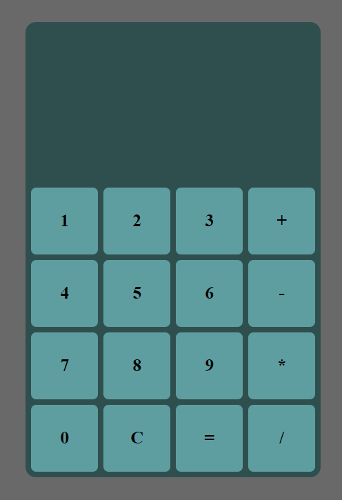

# Getting Started with Create React App
In this project I have used React to create a basic stylish calculator with all the basic functionalities

## Installation
- Ensure you have installed [Node js(npm)](https://nodejs.org/)
- Clone the repository
- Then in your temrinal:
 ``` 
  cd calculator
  ```
 ``` 
  npm start
  ```
## Overview


